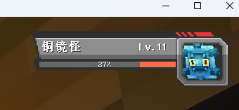
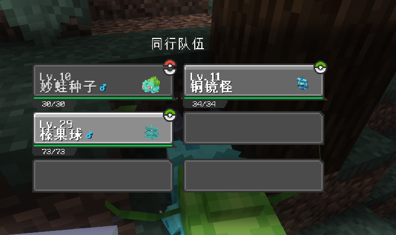
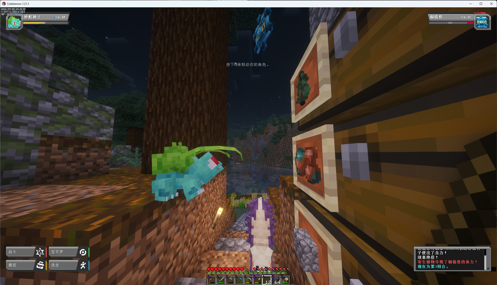
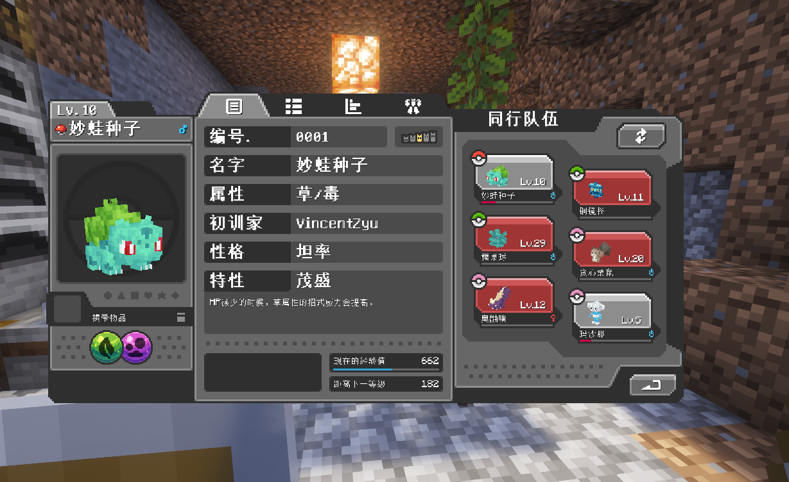
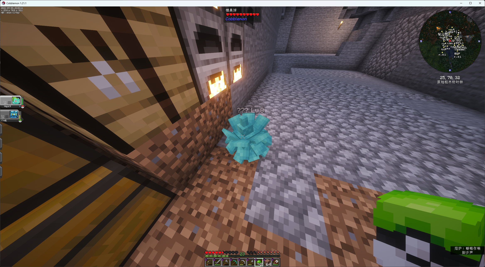
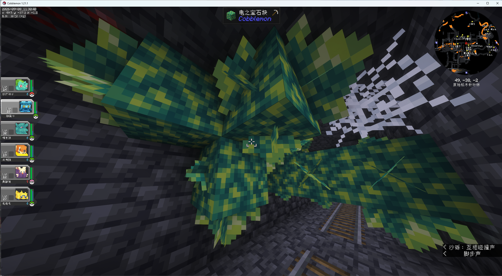
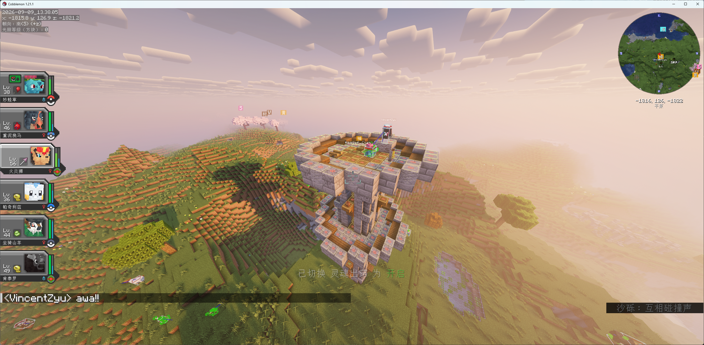
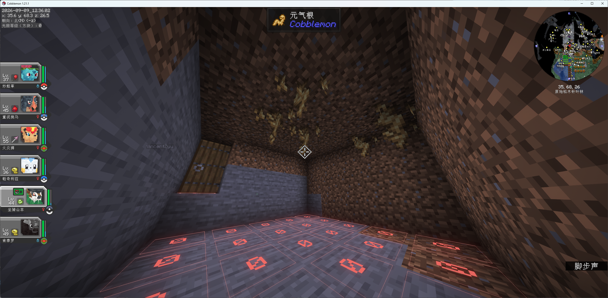
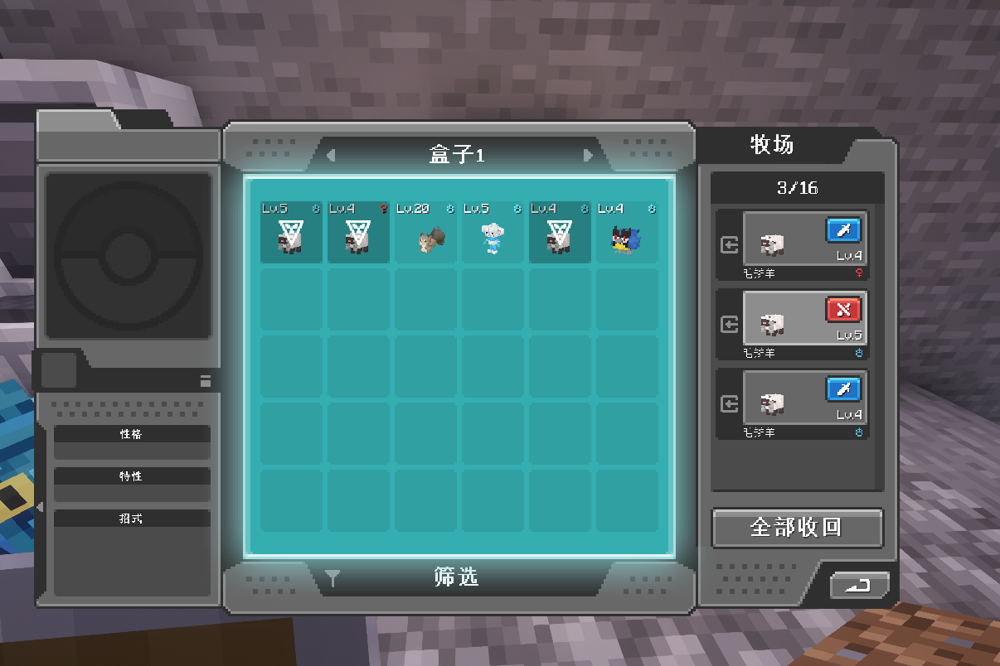
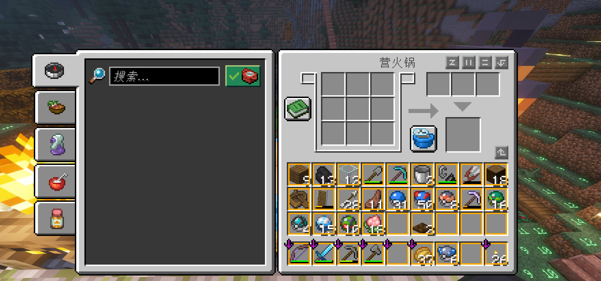

# Zyu 的 Cobblemon 游玩笔记

[](https://vincentzyu233.github.io/zyu-cobblemon-note/)

这是 Zyu 游玩个人 Minecraft 宝可梦整合包时整理的中文笔记，记录实际遇到的资源、捕捉、培育、机器、多人游玩与服务器维护问题。内容以便于自己和同伴查阅为目标，仅供参考，不是 Cobblemon 或任何整合包的官方文档。

## 适用范围与注意事项

- 游戏版本：Minecraft Java Edition 1.21.1。
- 模组加载器：Fabric Loader 0.19.5。
- 核心模组：Cobblemon `1.8.0+1.21.1`；本文配方、机制与截图均以这套实际运行的整合包为准。
- 模组版本、数据包、配置和服务器规则会影响配方、生成、数值与指令权限。其他整合包、旧版本或未来版本请先通过游戏内 JEI、模组配置和对应版本源码核验，不能直接照搬。
- 图片、经验和推荐来自个人游玩过程，可能不完整或随版本过期；发现错误时以当前版本游戏内行为为准。

本项目使用 VitePress 构建，并由 GitHub Actions 部署到 GitHub Pages。

## 游玩截图

| 战斗与捕捉 | 队伍成长 |
| --- | --- |
|  |  |
|  |  |

| 野外探索 | 基地与资源 |
| --- | --- |
|  |  |
|  |  |

| 机器与牧场 | 料理与培养 |
| --- | --- |
|  |  |

## 本地运行

```powershell
npm ci
npm run dev
```

默认访问地址为 `http://127.0.0.1:60908/zyu-cobblemon-note/`。

## 构建

```powershell
npm run build
```

生成物位于 `docs/.vitepress/dist/`，由 CI 上传部署，不提交到仓库。
