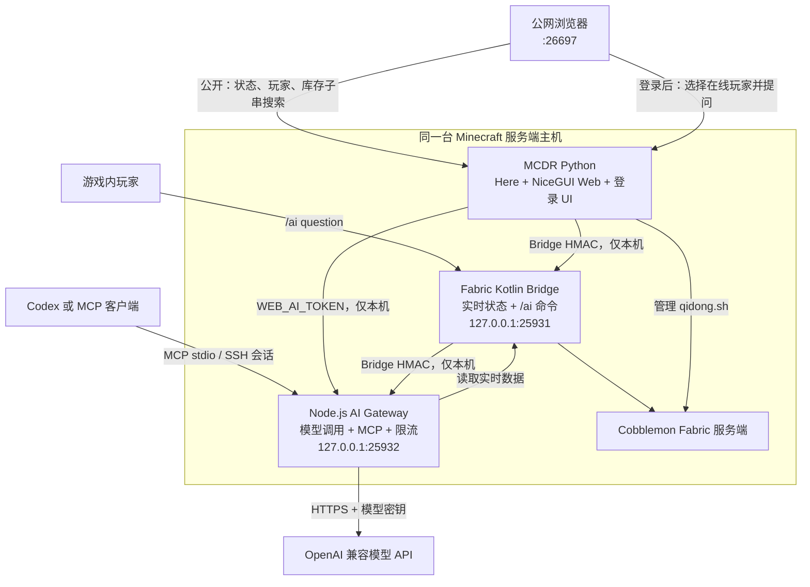

# AI 集成：实时进度助手

这是一套给当前 Cobblemon 朋友服准备的只读辅助能力：它让网页、游戏内命令和兼容 MCP 的 AI 在需要时读取真实进度，而不是根据截图猜测。它不会给物品、移动宝可梦、执行 OP 指令、加载区块或修改世界数据。

::: tip 当前状态：`0.2.0` 已实现，待 CI Artifact 部署与开服实测

已部署的组件仍为 `0.1.1`；本次 `0.2.0` 会由 CI 生成 Fabric 数据桥、Node Gateway 与 MCDR Web 插件 Artifact，确认停服窗口后统一替换。Gateway 已由 systemd 接管且仅监听 `127.0.0.1:25932`，同时已无泄漏核对 Fabric `sharedSecret` 与 Gateway `BRIDGE_SECRET` 一致。服务端当前有人在线，不能直接替换；部署后需由实际玩家验证游戏内 `/ai question` 的正常回答、冷却提示与回传消息。

:::

## 当前进度

- Fabric 数据桥与 Node 网关源码已在本仓库，CI 可构建 Fabric Jar、网关部署包和 MCDR Web 插件 Artifact。
- 自研 MCDR NiceGUI 面板已完成源码和烟雾测试；`0.2.0` 修复中文用户名的 UTF-8 安全比较，并提高深色模式下输入框、表格与次级文字的明度层级。网页默认端口为 `26697`。
- Node 网关已支持游戏内 `/ai question`、网页登录后的 `/v1/web-questions` 与 MCP stdio，只监听 `127.0.0.1:25932`。
- Cobblemon 服务端已移动至 `/data/data1/minecraft/mcdr-cobblemon/cobblemon`，由 MCDR 的 `working_directory` 管理。
- `Games_AI` 的 fork 已整理：`main` 对齐上游，`tyy-superflat-test` 保留天翼云超平坦测试服工作。曾创建的 `zyu-cobblemon` 只读实验分支未部署，后续会删除，不进入最终架构。
- 原有的实时助手、MCDR 面板、部署连接、游戏内/MCP 用法四篇说明已经与本页规划合并；侧栏只保留本页入口。

## 最终架构



## 各自职责

| 层 | 技术 | 负责什么 | 明确不做什么 |
|---|---|---|---|
| 数据桥 | Kotlin / Fabric | 从服务端内存读取 TPS、MSPT、在线玩家、背包、队伍、电脑与登记容器；提供 `/ai` 命令和回答回传 | 不保存模型密钥，不直接访问模型 API，不写入游戏数据 |
| 网页与管理 | Python / MCDR / NiceGUI | 管理 `qidong.sh`、提供 Here、公开进度面板、网页登录、库存子串搜索与网页 AI 界面 | 不解析存档，不重复读取世界，不直接调用模型，不修改服务端 |
| AI 网关 | Node.js / TypeScript | 统一模型调用、限流、MCP stdio、游戏内问答与网页问答；从 Bridge 取得实时上下文 | 不暴露公网端口，不执行 Minecraft 命令，不移动物品或控制 Bot |

::: tip 为什么保留独立 Node 网关

模型请求、密钥、限流、MCP stdio 和网络超时都属于外部服务边界。把它们放在 Kotlin 服务端会扩大卡服与密钥暴露风险；放入 MCDR 则会使网页重载、服务端管理和模型调用强耦合。网关只监听回环地址，正好承担这层隔离。

:::

## 能读取什么

- TPS、MSPT、在线人数和当前玩家位置、生命、饥饿值。
- 在线玩家背包汇总、Cobblemon 队伍，以及明确查询时的电脑宝可梦摘要。
- 手工登记的基地范围、单个箱子、木桶、潜影盒和机器库存。

不会为了查询而加载区块或读取存档。登记位置所在区块未加载时，Bridge 会返回 `unloaded`；网页与 MCP 必须明确显示“结果不完整”，不能把它当作空箱子。

`accessMode` 控制游戏内 `/ai` 读取范围：`public_full` 允许所有人读取、`self_and_admin` 限制普通玩家只读自己的 `player`/`party`、`admin_only` 仅管理员可用。`status` 始终可查看且不含玩家隐私数据。

## 网页面板

MCDR Web 面板在公网 `26697/TCP` 提供只读进度视图：未登录用户可看状态、在线玩家和已加载登记容器，并按 `iron_ingot`、`cobblemon:poke_ball` 等物品 ID 做子串搜索。

网页 AI 不会直接暴露 Node 网关。登录成功后，用户先在当前在线玩家中选择一位作为上下文，再由 MCDR 在本机调用网关。该提问与游戏内问答共享配额，不给物品、不执行命令、不控制 Bot。

::: warning 修改 MCDR 私有配置后要重载

`config/zyu_cobblemon_web/config.json` 中的 `bridge_secret`、网页账号或会话密钥在插件启动时读取。修改后必须重载自研插件或重启 MCDR；否则内存仍使用旧值，网页会出现 Fabric Bridge `HTTP 401`。本次 `0.2.0` 只修复中文账号比较，不改变这个运行时配置规则。

:::

::: tip Here 插件

Here 是独立的 MCDR 信息插件，用于显示坐标并高亮玩家。它与网页 AI、Fabric Bridge 没有数据写入关系；最终在 MCDR 控制台使用 `!!MCDR plugin install here` 安装。

:::

## 游戏内命令与 MCP

### 游戏内 `/ai`

```mcfunction
/ai status
/ai players
/ai player 玩家名
/ai party 玩家名
/ai base 基地名
/ai question 我目前有哪些材料能做治疗仪？
```

前五个命令直接返回 Bridge 数据。`/ai question` 会异步排队，在模型回答后以游戏内系统消息回传；每位玩家默认 60 秒一次、全服单并发、每日 100 次，问题最长 500 字。提交成功会显示“已提交问题”；密钥不匹配才会显示 `401 unauthorized`，冷却、单并发或日限会显示 `429 question_rate_limited`，不再把两类错误混为一谈。

### MCP 工具

Node 网关通过 stdio 暴露 MCP，不监听公网 HTTP。兼容 MCP 的 Agent 可通过 SSH 会话运行它，读取：

- `get_server_status`、`list_online_players`。
- `get_player_progress`、`get_player_party`、`get_player_pc_summary`。
- `list_bases`、`get_base_inventory`。

服务器未启动、玩家离线、SSH 隧道断开或区块未加载时，工具返回错误或状态，不能使用缓存猜测。

## 权限与密钥

未登录用户只能查看实时状态、在线玩家和已加载登记容器，并按物品 ID 做子串搜索。网页 AI 必须登录，且必须在在线玩家列表中选中一位作为进度上下文。

| 名称 | 用途 | 远程私有位置 |
|---|---|---|
| `sharedSecret` / `BRIDGE_SECRET` | Fabric Bridge 与 Node 网关的 HMAC；MCDR 查询 Bridge 使用对应 `bridge_secret` | Fabric 私有 JSON、网关 `.env`、MCDR 私有 JSON |
| `WEB_AI_TOKEN` | MCDR Web 调用网关 `/v1/web-questions` 的独立凭据 | MCDR 私有 JSON、网关 `.env` |
| `OPENAI_API_KEY` | 网关访问模型 API | 网关 `.env` |
| `OPENAI_BASE_URL` / `OPENAI_MODEL` | 模型连接配置 | 网关 `.env` |
| 网页账号与 `password_hash` | 网页 AI 登录 | MCDR 私有 JSON |
| `web_session_secret` | NiceGUI 登录 Cookie 签名 | MCDR 私有 JSON |

账号密码只在部署时从被 Git 忽略的 `temp/private/账号密码.md` 读取，用于生成 PBKDF2 哈希。源码、默认配置、Artifact、日志和文档中均不得出现明文密码、API Key、Bridge 密钥或 Web token。

::: warning 网页 AI 的双重校验

网关的 `/v1/web-questions` 必须同时要求请求来自 `127.0.0.1` 或 `::1`，并使用定长安全比较验证 `WEB_AI_TOKEN`。公网浏览器永远不会直接访问 Node 网关。

:::

## 后续规划

### 已完成的代码收敛

1. `Games_AI` 不进入最终架构；其 fork 仅保留 `main` 上游镜像与 `tyy-superflat-test` 历史分支。
2. MCDR Web 已移除 Games_AI 依赖，登录后只允许从在线玩家中选择一位作为 AI 上下文。
3. Node 网关已实现仅回环可访问的 `/v1/web-questions`，以独立 token 验证，并与游戏内问答共用单并发、60 秒冷却、每日 100 次与 500 字限制。
4. 网关会在 `/data/data1/aaa_from_git_aaa/cobblemon` 内有界检索最多 120 个候选源码文件、最多 6 段和 12 KB 片段，再连同实时状态交给模型。
5. 本页是唯一 AI 集成入口；后续维护只更新本页，避免再次拆分职责与部署说明。

### 通过 CI 后：远程部署

1. 使用带 `[build-action]` 的提交生成 `0.2.0` Fabric Jar、Node 网关和 MCDR Web Artifact；只部署 Artifact，不复制源码到插件目录。
2. 将 `/data/data1/minecraft/cobblemon` 移入 `/data/data1/minecraft/mcdr-cobblemon/cobblemon`。
3. 在 MCDR 根目录用 Python 3.12 和 uv 初始化运行环境，配置：

```yaml
working_directory: cobblemon
start_command: ./qidong.sh
handler: vanilla_handler
encoding: utf8
```

4. 只安装 Here 和自研 Web 插件。MCDR 前台以 `uv run mcdreforged` 验收，稳定后再由 MCSM 管理常驻。
5. 从私有凭据文件生成网页密码哈希和 `WEB_AI_TOKEN`；网关 `.env` 使用 `600` 权限。

### MCSM 接管设置

前台验收完成后，MCSM 不再直接执行游戏目录里的 `qidong.sh`，而是启动 MCDR。把实例工作目录和启动命令设为：

```text
工作目录：/data/data1/minecraft/mcdr-cobblemon
启动命令：/data/data1/minecraft/mcdr-cobblemon/.venv/bin/mcdreforged start
```

这条命令不依赖 shell 激活 `uv`，因为它直接使用已验证的 Python 3.12 虚拟环境。MCDR 会在该目录中读取 `config.yml`，并在 `cobblemon/` 下执行 `./qidong.sh`；不要把 MCSM 的工作目录再设回旧的 `/data/data1/minecraft/cobblemon`。

部署时网关环境文件至少包含：

```dotenv
OPENAI_API_KEY=...
OPENAI_BASE_URL=https://api.openai.com/v1
OPENAI_MODEL=...
BRIDGE_SECRET=与 Fabric sharedSecret 相同
BRIDGE_URL=http://127.0.0.1:25931
GATEWAY_HOST=127.0.0.1
GATEWAY_PORT=25932
WEB_AI_TOKEN=独立随机字符串
COBBLEMON_SOURCE_ROOT=/data/data1/aaa_from_git_aaa/cobblemon
MAX_DAILY_QUESTIONS=100
QUESTION_COOLDOWN_SECONDS=60
```

### 验收清单

- 公网 `http://43.248.3.161:26697` 能打开进度面板。
- 未登录库存子串搜索可用；未加载容器明确显示不完整，不被误判为空。
- 登录后可选择在线玩家并获得 AI 回答。
- 缺失 token、错误 token、非 loopback 来源均被网关拒绝。
- 游戏内 `/ai question` 与 MCP 工具仍可工作，且没有任何写入、给物品或 Bot 控制能力。
