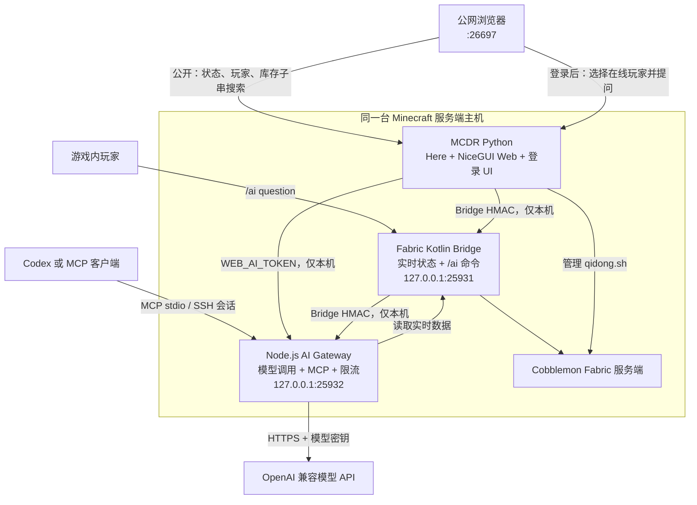

# AI 集成：实时进度助手

这是一套给当前 Cobblemon 朋友服准备的只读辅助能力：它让网页、游戏内命令和兼容 MCP 的 AI 在需要时读取真实进度，而不是根据截图猜测。它不会给物品、移动宝可梦、执行 OP 指令、加载区块或修改世界数据。

::: warning 当前服务器有人游玩

本页记录的是当前状态和后续方案。MCDR 接管、目录移动、插件安装、密钥配置与服务端重启均应等服务器空闲后再进行。

:::

## 当前进度

- Fabric 数据桥与 Node 网关源码已在本仓库，CI 可构建 Fabric Jar、网关部署包和 MCDR Web 插件 Artifact。
- 自研 MCDR NiceGUI 面板已完成源码和烟雾测试；网页默认端口已调整为 `26697`，但远程 MCDR 尚未部署。
- 现有 Node 网关已支持游戏内 `/ai question` 与 MCP stdio，并仅计划监听 `127.0.0.1:25932`。
- 远程 Cobblemon 服务端仍位于 `/data/data1/minecraft/cobblemon`，尚未移动到 MCDR 管理目录。
- `Games_AI` 的 fork 已整理：`main` 对齐上游，`tyy-superflat-test` 保留天翼云超平坦测试服工作。曾创建的 `zyu-cobblemon` 只读实验分支未部署，后续会删除，不进入最终架构。
- 当前四篇旧文档仍保留，侧栏和 README 尚未切换；本页是后续四合一的目标内容。

## 最终架构



## 各自职责

| 层 | 技术 | 负责什么 | 明确不做什么 |
|---|---|---|---|
| 数据桥 | Kotlin / Fabric | 从服务端内存读取 TPS、MSPT、在线玩家、背包、队伍、电脑与登记容器；提供 `/ai` 命令和回答回传 | 不保存模型密钥，不直接访问模型 API，不写入游戏数据 |
| 网页与管理 | Python / MCDR / NiceGUI | 管理 `qidong.sh`、提供 Here、公开进度面板、网页登录、库存子串搜索与网页 AI 界面 | 不解析存档，不重复读取世界，不直接调用模型，不修改服务端 |
| AI 网关 | Node.js / TypeScript | 统一模型调用、限流、MCP stdio、游戏内问答与网页问答；从 Bridge 取得实时上下文 | 不暴露公网端口，不执行 Minecraft 命令，不移动物品或控制 Bot |

::: tip 为什么保留独立 Node 网关

模型请求、密钥、限流、MCP stdio 和网络超时都属于外部服务边界。把它们放在 Kotlin 服务端会扩大卡服与密钥暴露风险；放入 MCDR 则会使网页重载、服务端管理和模型调用强耦合。网关只监听回环地址，正好承担这层隔离。

:::

## 权限与密钥

未登录用户只能查看实时状态、在线玩家和已加载登记容器，并按物品 ID 做子串搜索。网页 AI 必须登录，且必须在在线玩家列表中选中一位作为进度上下文。

| 名称 | 用途 | 远程私有位置 |
|---|---|---|
| `sharedSecret` / `BRIDGE_SECRET` | Fabric Bridge 与 Node 网关的 HMAC；MCDR 查询 Bridge 使用对应 `bridge_secret` | Fabric 私有 JSON、网关 `.env`、MCDR 私有 JSON |
| `WEB_AI_TOKEN` | MCDR Web 调用网关 `/v1/web-questions` 的独立凭据 | MCDR 私有 JSON、网关 `.env` |
| `OPENAI_API_KEY` | 网关访问模型 API | 网关 `.env` |
| `OPENAI_BASE_URL` / `OPENAI_MODEL` | 模型连接配置 | 网关 `.env` |
| 网页账号与 `password_hash` | 网页 AI 登录 | MCDR 私有 JSON |
| `web_session_secret` | NiceGUI 登录 Cookie 签名 | MCDR 私有 JSON |

账号密码只在部署时从被 Git 忽略的 `temp/private/账号密码.md` 读取，用于生成 PBKDF2 哈希。源码、默认配置、Artifact、日志和文档中均不得出现明文密码、API Key、Bridge 密钥或 Web token。

::: warning 网页 AI 的双重校验

网关的 `/v1/web-questions` 必须同时要求请求来自 `127.0.0.1` 或 `::1`，并使用定长安全比较验证 `WEB_AI_TOKEN`。公网浏览器永远不会直接访问 Node 网关。

:::

## 后续规划

### 服务器空闲后：代码与文档收敛

1. 删除未部署的 `Games_AI/zyu-cobblemon` 本地与远端分支，保留 `main` 镜像和 `tyy-superflat-test`。
2. MCDR Web 移除 `Games_AI` 依赖，保留登录；登录后显示在线玩家选择器和网页 AI 区域。
3. Node 网关新增仅回环可访问的 `/v1/web-questions`，验证独立 token，复用全服单并发、60 秒冷却、每日 100 次与 500 字限制。
4. 网关从 `/data/data1/aaa_from_git_aaa/cobblemon` 有界检索源码片段，并将片段、实时服务器状态和所选玩家进度提供给模型。
5. 将旧的 `ai-integration.md`、`mcdr-web.md`、`ai-installation.md`、`ai-commands.md` 收敛到本页，更新 VitePress 侧栏与 README，删除旧页面和过时的 Games_AI 描述。

### 通过 CI 后：远程部署

1. 使用带 `[build-action]` 的提交生成 Fabric Jar、Node 网关和 MCDR Web Artifact；只部署 Artifact，不复制源码到插件目录。
2. 将 `/data/data1/minecraft/cobblemon` 移入 `/data/data1/minecraft/mcdr-cobblemon/cobblemon`。
3. 在 MCDR 根目录用 Python 3.12 和 uv 初始化运行环境，配置：

```yaml
working_directory: cobblemon
start_command: ./qidong.sh
handler: vanilla_handler
encoding: utf8
```

4. 只安装 Here 和自研 Web 插件。MCDR 前台以 `uv run mcdreforged` 验收，稳定后再由 MCSM 管理常驻。
5. 从私有凭据文件生成网页密码哈希和 `WEB_AI_TOKEN`；网关 `.env` 使用 `600` 权限。

### 验收清单

- 公网 `http://43.248.3.161:26697` 能打开进度面板。
- 未登录库存子串搜索可用；未加载容器明确显示不完整，不被误判为空。
- 登录后可选择在线玩家并获得 AI 回答。
- 缺失 token、错误 token、非 loopback 来源均被网关拒绝。
- 游戏内 `/ai question` 与 MCP 工具仍可工作，且没有任何写入、给物品或 Bot 控制能力。
